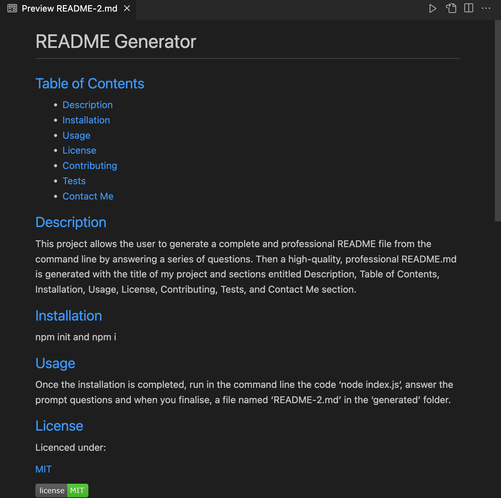
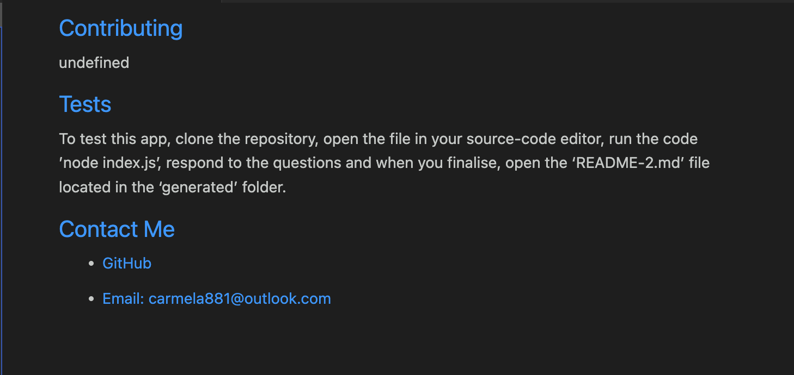

# Readme File Generator
README file generator using a command-line application and Node.js

  ## [Table of Contents](#table-of-contents)

  - [Description](#description)
  - [Final Result](#final-result)
  - [Installation](#installation)
  - [Usage](#usage)
  - [License](#license)
  - [Contributing](#contributing)
  - [Tests](#tests)
  - [Contact Me](#contact)

  ## [Description](#table-of-contents)

  This project allows the user to generate a complete and professional README file from the command line by answering a series of questions. Then a high-quality, professional README.md is generated with the title of my project and sections entitled Description, Table of Contents, Installation, Usage, License, Contributing, Tests, and Contact Me section.

  ## [Final Result](#table-of-contents)

  

  

  ## [Installation](#table-of-contents)

  npm init and npm i

  ## [Usage](#table-of-contents)

  Once the installation is completed, run in the command line the code ‘node index.js’, answer the prompt questions and when you finalise, a file named ‘README-2.md’ in the ‘generated’ folder.

  ## [License](#table-of-contents)
  Licenced under:
    
    
  [MIT](https://choosealicense.com/licenses/MIT)
    
    

  
  
 

  ## [Tests](#table-of-contents)

  To test this app, clone the repository, open the file in your source-code editor, run the code ’node index.js’, respond to the questions and when you finalise, open the ‘README-2.md’ file located in the ‘generated’ folder.

  ## [Contact Me](#table-of-contents)

  - [GitHub](https://github.com/cdrcar)

  - [Email: carmela881@outlook.com](mailto:carmela881@outlook.com)

